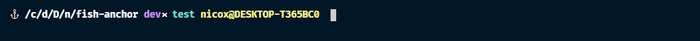

# fish-anchor

An elegant and minimalist theme for the [Fish Shell](https://fishshell.com).

## Features

- Displays the directory.
- Support for `git` *(branch name and repository status)*.
- Shows the name of a Docker container if one.
- Displays information of an SSH connection.

### Git

The little symbol displayed next to the branch name has a meaning:

| Symbol | Meaning |
|---|---|
| ⥄ | Branch diverged |
| ↑ | Commits to push |
| ↓ | Changes to pull |
| ⨯ | Not staged changes |
| ◦ | Branch up-to-date |
|  | Nothing |

## Screenshot

- *White:* Current working directory.
- *Magenta:* Repository branch name with repository status.
- *Cyan:* Docker container's name.
- *Yellow:* Username and hostname of an SSH connection.

## Installation

### Requirements

You need [Fish Shell](https://fishshell.com) and [Oh My Fish!](https://github.com/oh-my-fish/oh-my-fish/).

### Installing

Using **Oh-My-Fish**:

`omf install anchor`,

`omf theme anchor`.

## License

The theme is licensed under the MIT License,
please read the [LICENSE](LICENSE) file to get more information.
